<div align="center">

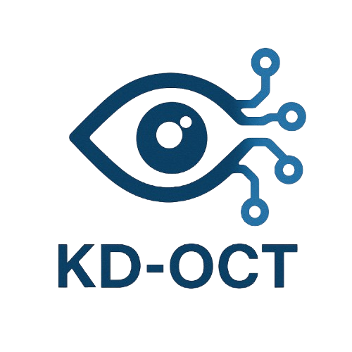

# KD-OCT: Efficient Knowledge Distillation for Clinical-Grade Retinal OCT Classification

### Bridging Clinical Precision and Efficiency in Retinal OCT Classification

[](https://www.python.org/downloads/)
[](https://pytorch.org/)
[](https://opensource.org/licenses/MIT)
[](https://github.com/erfan-nourbakhsh/KD-OCT)

[**Paper**](https://github.com/erfan-nourbakhsh/KD-OCT) | [**Methodology**](#-Methodology) | [**Installation**](#-Quick-Start) | [**Datasets**](#-datasets) | [**Performance Comparison**](#-Performance-Comparison) 

</div>

---

## 📋 Overview

Age-related macular degeneration (AMD) and choroidal neovascularization (CNV)-related conditions are leading causes of vision loss worldwide, with **optical coherence tomography (OCT)** serving as a cornerstone for early detection and management. However, deploying state-of-the-art deep learning models like **ConvNeXtV2-Large** in clinical settings is hindered by their computational demands.

**KD-OCT** is a novel knowledge distillation framework that compresses a high-performance ConvNeXtV2-Large teacher model into a lightweight EfficientNet-B2 student while maintaining exceptional diagnostic performance. This enables **real-time deployment in edge devices** for AMD screening applications.

### 🎯 Key Features

- 🧠 **Advanced Knowledge Distillation**: Real-time distillation with combined soft-hard loss
- 🚀 **Lightweight Architecture**: ~75% parameter reduction (EfficientNet-B2 student)
- 📊 **Superior Performance**: Near-teacher accuracy with 5-fold cross-validation
- 🔬 **Multiple Architectures**: KD-OCT framework comprising a ConvNeXtV2-Large Teacher and an EfficientNet-B2 Student
- 📁 **Modular Codebase**: Clean, production-ready architecture
- 🎓 **Two Datasets**: NEH (3-class) and UCSD (4-class) OCT datasets
- ⚡ **Fast Inference**: Optimized for clinical deployment

---

### Model Specifications

| Model | Backbone | Params(mil)
|-------|----------|--------|
| **KD-OCT** | ConvNeXtV2-Large | 196.4 |
| **KD-OCT** | EfficientNet-B2 | 7.7 |
| **MedSigLip** | MedSigLIP | 430.4 |
| **SFNet** | ConvNeXt | 29.2 |

---

## 🚀 Quick Start

### Prerequisites

```bash
# Python 3.10 or higher
python --version

# CUDA 11.0+ (for GPU support)
nvcc --version
```

### Installation

```bash
# Clone the repository
git clone https://github.com/erfan-nourbakhsh/KD-OCT.git
cd KD-OCT

# Install dependencies
pip install torch torchvision timm
pip install scikit-learn pandas numpy matplotlib seaborn
pip install pillow tqdm tensorboard
```

---

## 📦 Datasets

### 1. Download Datasets

#### NEH Dataset (3-class: Normal, Drusen, CNV)
- **Source**: [Noor Eye Hospital Dataset](https://data.mendeley.com/datasets/8kt969dhx6/1)
- **Images**: 12,649 OCT B-scans from 441 patients

#### UCSD Dataset (4-class: Normal, Drusen, CNV, DME)
- **Source**: [UCSD OCT Dataset](https://data.mendeley.com/datasets/rscbjbr9sj/3)
- **Images**: 108,312 OCT images

### 2. Dataset Organization

After downloading, organize your datasets as follows:

```
KD-OCT/
├── Dataset/
│   ├── NEH/
│   │   ├── NEH_UT_2021RetinalOCTDataset/
│   │   │   ├── NORMAL/
│   │   │   ├── DRUSEN/
│   │   │   └── CNV/
│   │   └── data_information.csv
│   │
│   └── UCSD/
│       └── CellData/
│           └── OCT/
│               ├── train/
│               │   ├── NORMAL/
│               │   ├── DRUSEN/
│               │   ├── CNV/
│               │   └── DME/
│               └── test/
│                   ├── NORMAL/
│                   ├── DRUSEN/
│                   ├── CNV/
│                   └── DME/
```

---

## 🎮 Usage

### Simple Command-Line Interface

Run any model with a single command:

```bash
python run.py <model_name>
```

### Available Models

| Command | Description | Dependency |
|---------|-------------|------------|
| `KD-OCT-Teacher-NEH` | Teacher model on NEH dataset | None |
| `KD-OCT-Student-NEH` | Student model on NEH dataset | Requires Teacher-NEH |
| `KD-OCT-Teacher-UCSD` | Teacher model on UCSD dataset | None |
| `KD-OCT-Student-UCSD` | Student model on UCSD dataset | Requires Teacher-UCSD |
| `MedSigLip` | MedSigLIP medical model | None |
| `SFNet` | SF-Net multi-scale model | None |

### Training Examples

#### Train Teacher Model (NEH Dataset)
```bash
python run.py KD-OCT-Teacher-NEH
```

#### Train Student Model (Knowledge Distillation)
```bash
# First, ensure teacher is trained
python run.py KD-OCT-Teacher-NEH

# Then train student with knowledge distillation
python run.py KD-OCT-Student-NEH
```

#### Train Other Models
```bash
# MedSigLip model
python run.py MedSigLip

# SFNet model
python run.py SFNet
```

#### List All Models
```bash
python run.py --list
```

#### Show Help
```bash
python run.py --help
```


---

## 🔬 Methodology

### I. Proposed Approach

#### A. Data Preparation

Datasets were split into training, validation, and test sets with patient-level stratification to prevent data leakage (Figure 1). For NEH: 20% test, 16% validation, 64% training. For UCSD: predefined 1,000-image test set; remaining 108,312 images split 80% training / 20% validation.

<div align="center">


*Figure 1. Overview of data preparation and augmentation pipelines in KD-OCT, including the training sequence with RandAugment and geometric/color transforms, minimal validation steps, and Test-Time Augmentation (TTA) variants for inference.*

</div>

#### B. Data Augmentation

Augmentation pipelines are customized for training, validation, and inference (Figure 1). **Training**: Resize (416×416) → Random crop (384×384) → RandAugment → Random rotation (±20°) → Affine (shear ±15°, scale 0.85-1.15) → Color jitter → Horizontal/Vertical flips → Gaussian blur → Posterize → Random erasing → Normalize. **Validation**: Resize (384×384) → Normalize. **Inference (TTA)**: Five variants (original, horizontal flip, vertical flip, center crop, rotation ±15°) are ensembled for improved robustness.

#### C. Teacher Model Architecture

The teacher employs ConvNeXtV2-Large, pretrained on ImageNet-22K/1K via FCMAE. Architecture (Figure 1): stem layer → 4 hierarchical stages (downsampling transitions) → classification head. Each stage contains ConvNeXtV2 blocks: DepthWise Conv → LayerNorm → Linear (expansion) → GELU → GRN → Linear (reduction) with residual connections. Progressive drop path regularization improves generalization. Global average pooling and fully connected layer generate logits for multi-class prediction.

#### D. Knowledge Distillation

KD-OCT transfers knowledge from ConvNeXtV2-Large teacher to EfficientNet-B2 student via real-time distillation (Figure 2). **Teacher training**: Focal loss for class imbalance, SWA, differential learning rates (head: 1e-4, backbone: 2e-5), AdamW, 10-epoch warmup, cosine annealing over 150 epochs. Focal loss: $L_{focal} = -\alpha (1 - p_t)^\gamma \log(p_t)$ where $\gamma=2.0$. **Student training**: Frozen teacher generates soft labels on-the-fly. Combined loss: $\alpha \cdot L_{KL}$ (soft, 0.7) + $\beta \cdot L_{CE}$ (hard, 0.3) with temperature 4.0. Lighter augmentation (reduced RandAugment intensity, ±15° rotation, no blur/posterize), unified learning rate (1e-3), AdamW with cosine annealing. Mixed precision (FP16) training with effective batch size 16 via gradient accumulation.

<div align="center">


*Figure 2. Overview of the KD-OCT framework, showing knowledge transfer from the ConvNeXtV2-Large teacher to the EfficientNet-B2 student via real-time distillation*

</div>

---

### II. Hyperparameters

| Parameter | Teacher | Student |
|-----------|---------|---------|
| **Learning Rate** | Head: 1e-4, Backbone: 2e-5 | Unified: 1e-3 |
| **Weight Decay** | 0.05 | 0.01 |
| **Warmup Epochs** | 10 | 5 |
| **Max Epochs** | 150 (patience: 25) | 100 (patience: 20) |
| **Batch Size** | 4 (accumulation: 4) | 8 (accumulation: 2) |
| **Optimizer** | AdamW | AdamW |
| **Scheduler** | Cosine annealing (to 1e-7) | Cosine annealing (to 1e-6) |
| **RandAugment** | N=2, M=9 | N=2, M=7 |
| **Rotation** | ±20° | ±15° |
| **Distillation** | Temperature: 4.0, α=0.7 (KL), β=0.3 (CE) | |

**Training**: FP16 mixed precision, effective batch size 16, NVIDIA H200 GPU.


---


## 📊 Performance Comparison

This section presents a detailed comparison of our proposed **KD-OCT framework** against existing state-of-the-art models across multiple benchmark datasets.  

---

### 🧠 NEH Dataset (3-Class Classification with 5-Fold Cross-Validation)

<div align="center">

| Model | Accuracy (%) | Sensitivity (%) | Specificity (%) | Params (M) |
|:------|:-------------:|:---------------:|:---------------:|:-----------:|
| HOG + SVM | 67.2 ± 3.7 | 66.9 ± 3.1 | 74.3 ± 2.5 | - |
| VGG16 | 91.6 ± 2.2 | 91.4 ± 2.0 | 95.6 ± 1.1 | 28.3 |
| ResNet50 | 86.8 ± 2.0 | 86.4 ± 1.6 | 93.0 ± 0.9 | 23.6 |
| DenseNet121 | 90.0 ± 1.4 | 89.7 ± 1.7 | 94.7 ± 0.8 | 7.0 |
| EfficientNetB0 | 85.4 ± 2.6 | 84.5 ± 2.2 | 92.1 ± 1.3 | 4.0 |
| FPN-VGG16 | 92.0 ± 1.6 | 91.8 ± 1.7 | 95.8 ± 0.9 | 21.6 |
| FPN-DenseNet121 | 90.9 ± 1.4 | 90.5 ± 1.9 | 95.2 ± 0.7 | 14.3 |
| SFNet | 82.6 ± 2.4 | 80.4 ± 2.8 | 96.2 ± 0.6 | 29.2 |
| MedSigLip | 84.5 ± 3.2 | 81.8 ± 4.6 | 94.4 ± 1.1 | 430.4 |
| **KD-OCT (Ours) ConvNeXtV2-Large** | **92.6 ± 2.3** | **92.9 ± 2.1** | **98.1 ± 0.8** | **196.4** |
| **KD-OCT (Ours) EfficientNet-B2** | **92.46 ± 1.36** | **92.15 ± 1.29** | **96.04 ± 0.78** | **7.7** |

</div>

Our method significantly improves both sensitivity and specificity compared to prior architectures while maintaining a compact model size, demonstrating the strength of our **knowledge distillation approach**.

---

### 🩺 UCSD Dataset (4-Class Classification)

<div align="center">

| Model | Preprocess | Accuracy (%) | Sensitivity (%) | Specificity (%) |
|:------|:-----------:|:-------------:|:----------------:|:----------------:|
| VGG16 | ✗ | 93.9 | 100 | 90.8 |
| ResNet50 | ✗ | 96.7 | 99.6 | 94.8 |
| EfficientNetB0 | ✗ | 95.0 | 99.8 | 91.4 |
| Kermany et al. | ✗ | 96.6 | 97.8 | 97.4 |
| Kaymak et al. | ✗ | 97.1 | 98.4 | 99.6 |
| Hassan et al. | ✓ | 98.6 | 98.27 | 99.6 |
| FPN-VGG16| ✗ | 98.4 | 100 | 97.4 |
| **KD-OCT (Ours) ConvNeXtV2-Large** | ✗ | **98.4** | **98.45** | **99.47** |
| **KD-OCT (Ours) EfficientNet-B2** | ✗ | **98.4** | **98.40** | **99.47** |

</div>

---

### 🔬 UCSD Dataset (4-Class Classification with 5-Fold Cross-Validation)

<div align="center">

| Model | Preprocess | Accuracy (%) | Sensitivity (%) | Specificity (%) |
|:------|:-----------:|:-------------:|:----------------:|:----------------:|
| Fang et al. (JVCIR) | ✗ | 87.3 | 84.7 | 95.8 |
| Fang et al. (TMI) | ✓ | 90.1 | 86.6 | 96.6 |
| FPN-VGG16 | ✗ | 93.9 | 93.4 | 98.0 |
| **KD-OCT (Ours) ConvNeXtV2-Large** | ✗ | **97.72** | **97.72** | **99.26** |
| **KD-OCT (Ours) EfficientNet-B2** | ✗ | **97.74** | **97.74** | **99.21** |

</div>

---

### ⚙️ Summary of Key Observations

- The proposed **KD-OCT** framework achieves **state-of-the-art performance** on both NEH and UCSD datasets.  
- The **student model (EfficientNet-B2)** retains high accuracy with significantly fewer parameters and lower inference time.  
- The **teacher model (ConvNeXtV2-Large)** provides strong supervision for distillation, boosting the overall robustness.  
- **Cross-validation results** confirm excellent generalization and stability across folds.

---


### Confusion Matrices

The following confusion matrices show the 5-fold cross-validation results for all experiments. Each fold demonstrates consistent performance across different data splits.

<div align="center">

#### Teacher Model - NEH Dataset (5-Fold Cross-Validation)

*ConvNeXtV2-Large teacher model on 3-class NEH dataset*

<div align="center">

| Fold 1 | Fold 2 | Fold 3 |
|:------:|:------:|:------:|
| 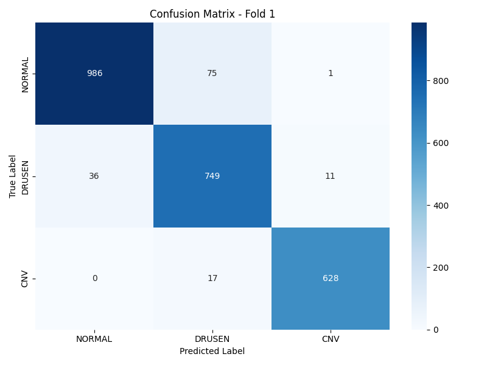 |  | 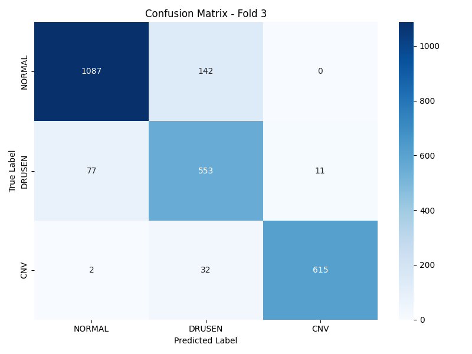 |

| Fold 4 | Fold 5 |
|:------:|:------:|
|  | 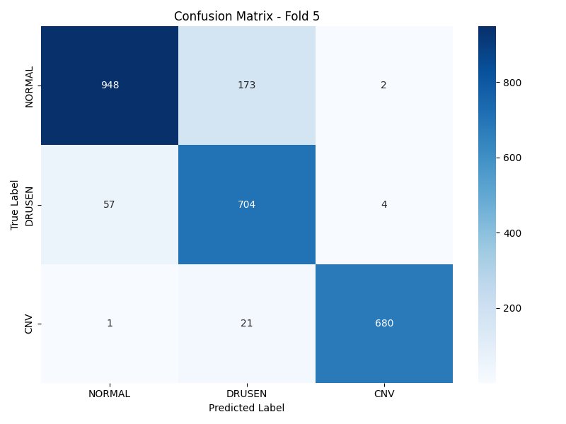 |

</div>

---

#### Student Model - NEH Dataset (5-Fold Cross-Validation)

*EfficientNet-B2 student model with knowledge distillation on 3-class NEH dataset*

<div align="center">

| Fold 1 | Fold 2 | Fold 3 |
|:------:|:------:|:------:|
|  | 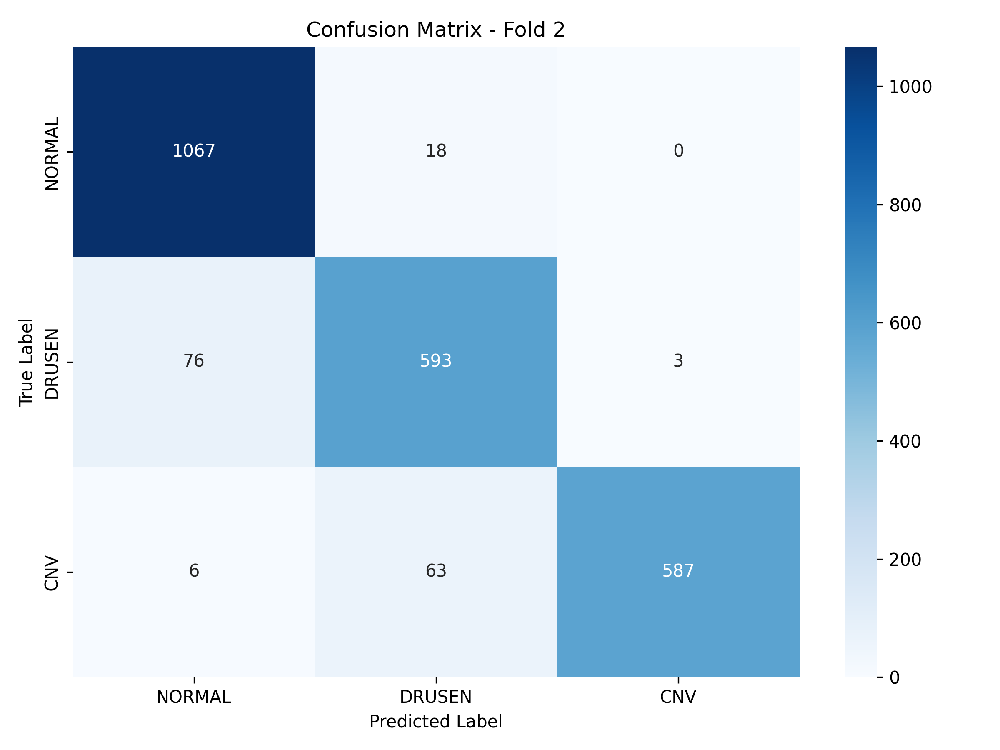 | 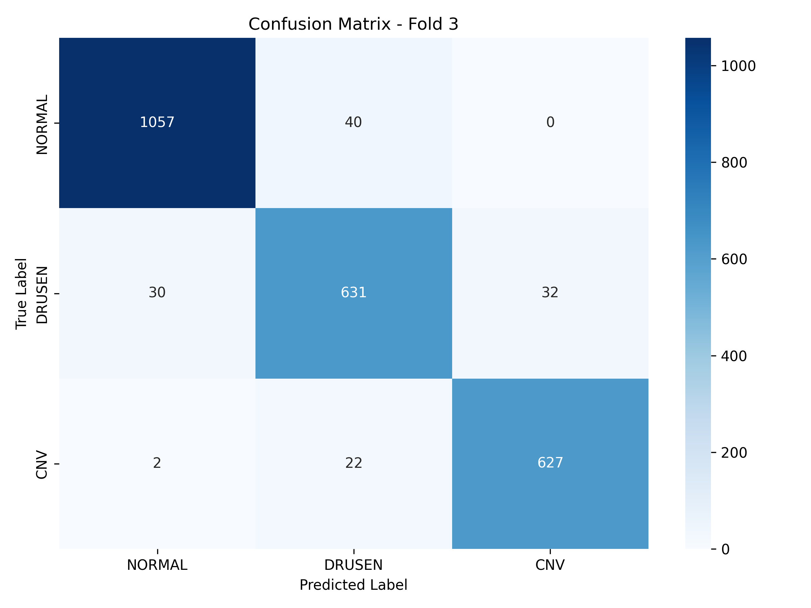 |

| Fold 4 | Fold 5 |
|:------:|:------:|
| 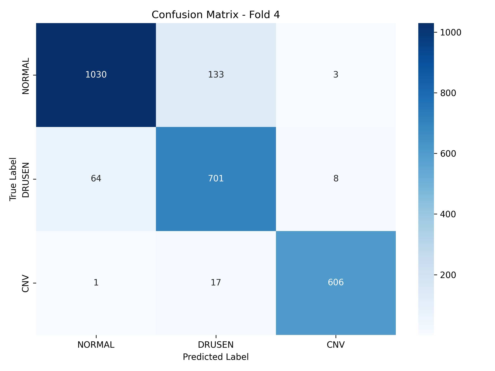 | 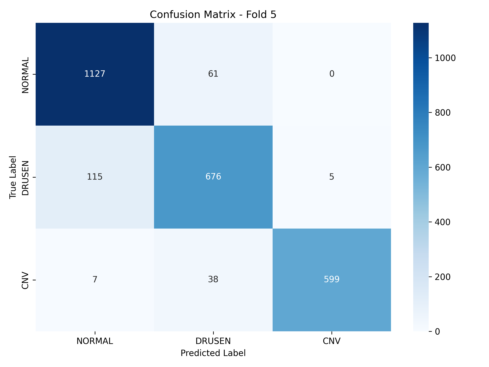 |

</div>

---

#### Teacher Model - UCSD Dataset (5-Fold Cross-Validation)

*ConvNeXtV2-Large teacher model on 4-class UCSD dataset*

<div align="center">

| Fold 1 | Fold 2 | Fold 3 |
|:------:|:------:|:------:|
|  |  | 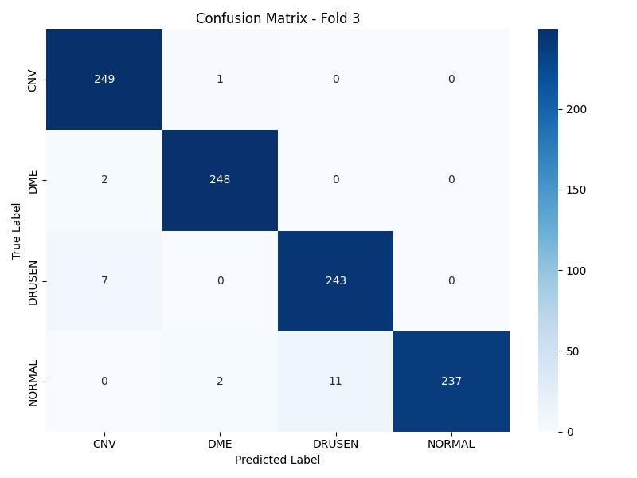 |

| Fold 4 | Fold 5 |
|:------:|:------:|
| 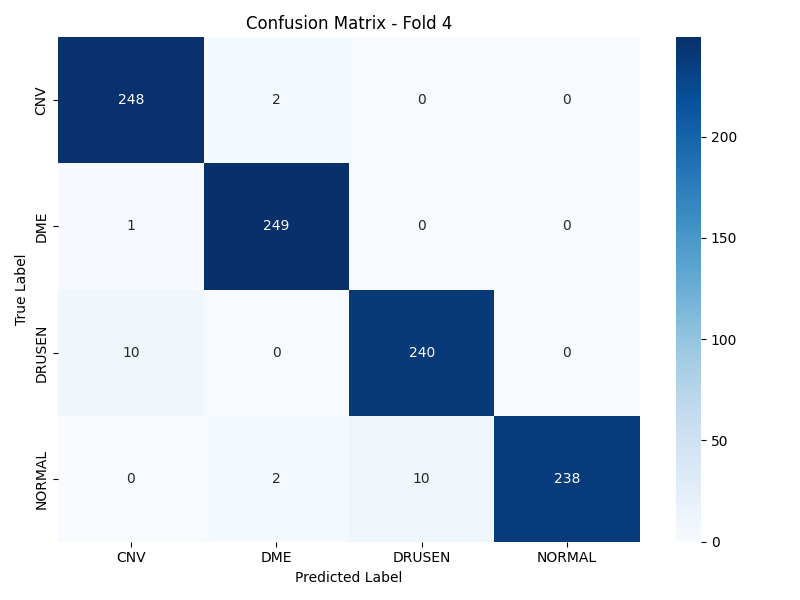 |  |

</div>

---

#### Student Model - UCSD Dataset (5-Fold Cross-Validation)

*EfficientNet-B2 student model with knowledge distillation on 4-class UCSD dataset*

<div align="center">

| Fold 1 | Fold 2 | Fold 3 |
|:------:|:------:|:------:|
| 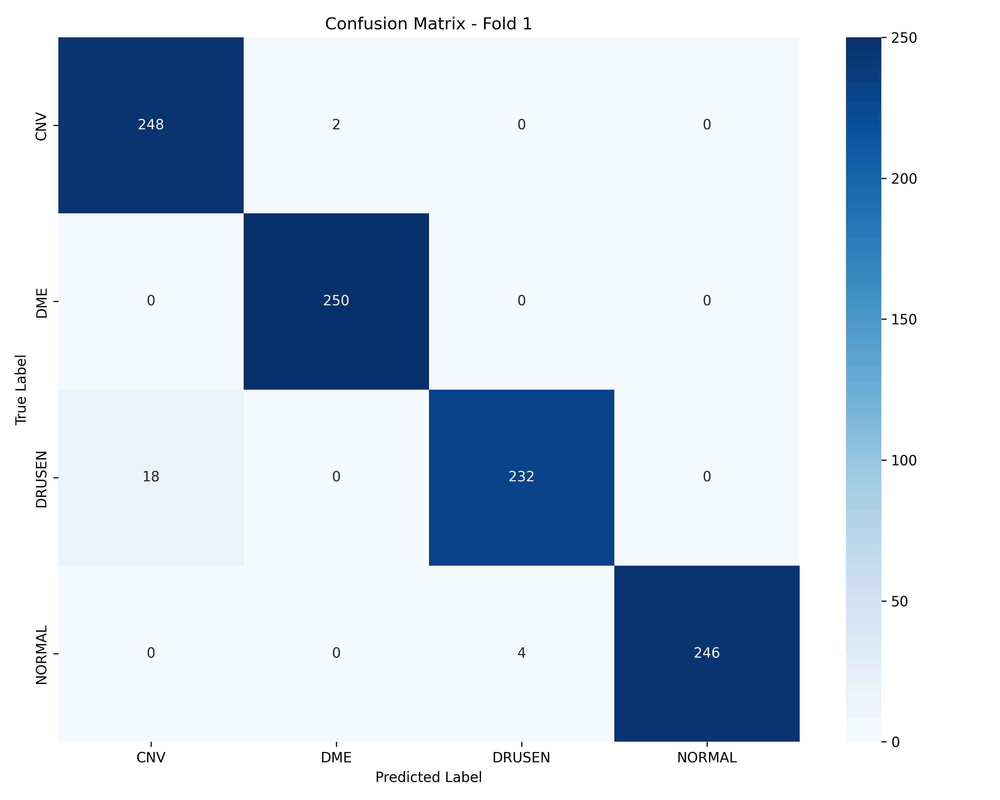 | 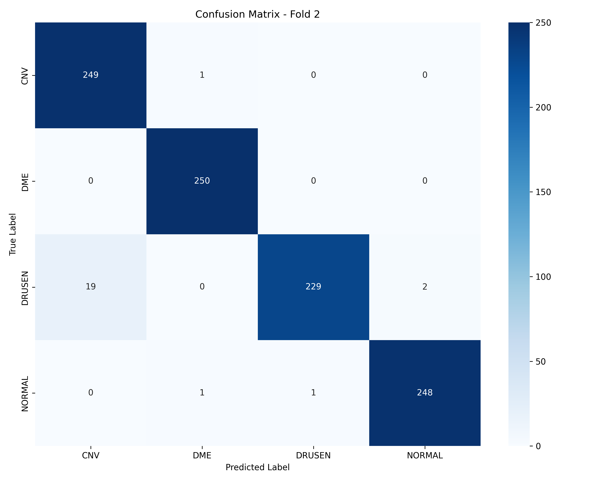 |  |

| Fold 4 | Fold 5 |
|:------:|:------:|
| 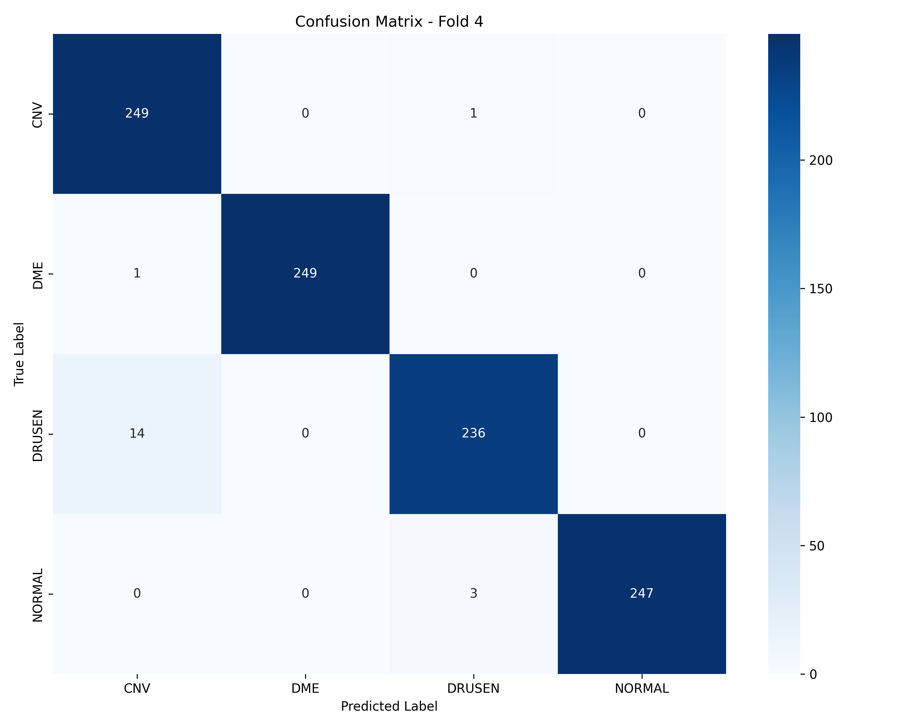 | 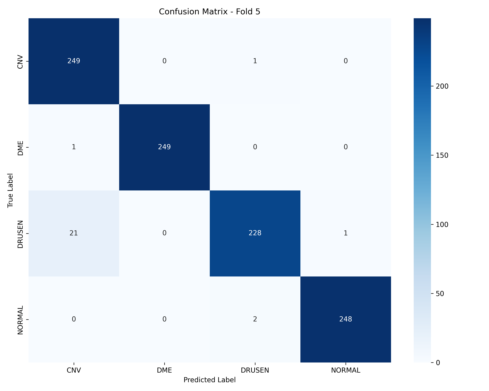 |

</div>

</div>

---


## 📁 Project Structure

```
KD-OCT/
├── run.py                                    # 🚀 Unified CLI entry point
├── README.md                                 # 📖 Complete documentation
│
├── Dataset/                                  # 📊 Dataset storage (not included in repo)
│   ├── NEH/                                  # Noor Eye Hospital dataset
│   │   ├── NEH_UT_2021RetinalOCTDataset/    # Image folders by class
│   │   └── data_information.csv             # Patient metadata
│   └── UCSD/                                 # UCSD Shiley Eye Institute dataset
│       └── CellData/OCT/                     # Train/test splits by class
│
├── Figures/                                  # 📈 Visualizations and results
│   ├── logo.png                              # Project logo
│   ├── Model Architecture/                   # Architecture diagrams
│   │   ├── model.png                         # Data prep & augmentation pipeline
│   │   └── knowledge distillation.png        # KD framework overview
│   ├── Teacher-NEH/                          # Teacher confusion matrices (NEH)
│   ├── Student-NEH/                          # Student confusion matrices (NEH)
│   ├── Teacher-UCSD/                         # Teacher confusion matrices (UCSD)
│   └── Student-UCSD/                         # Student confusion matrices (UCSD)
│
├── Teacher-Training/                         # 👨‍🏫 Teacher model training pipelines
│   ├── NEH/                                  # ConvNeXtV2-Large on NEH dataset
│   │   ├── main.py                           # Training entry point
│   │   ├── workflow.py                       # Complete training workflow
│   │   ├── requirements.txt                  # Python dependencies
│   │   ├── config/
│   │   │   ├── __init__.py
│   │   │   └── config.py                     # Hyperparameters & paths
│   │   ├── models/
│   │   │   ├── __init__.py
│   │   │   └── model_builder.py              # ConvNeXtV2-Large architecture
│   │   ├── data/
│   │   │   ├── __init__.py
│   │   │   ├── dataset.py                    # Dataset class with stratification
│   │   │   ├── data_loader.py                # DataLoader with K-fold CV
│   │   │   └── augmentation.py               # Heavy augmentation pipeline
│   │   ├── training/
│   │   │   ├── __init__.py
│   │   │   ├── train.py                      # Training loop with SWA
│   │   │   ├── evaluate.py                   # Validation & test evaluation
│   │   │   ├── losses.py                     # Focal loss implementation
│   │   │   └── utils.py                      # Training utilities
│   │   └── utils/
│   │       ├── __init__.py
│   │       ├── visualization.py              # Confusion matrices & plots
│   │       └── ensemble.py                   # Test-time augmentation
│   │
│   └── UCSD/                                 # ConvNeXtV2-Large on UCSD dataset
│       ├── main.py                           # (Same structure as NEH)
│       ├── workflow.py
│       ├── config/
│       ├── models/
│       ├── data/
│       ├── training/
│       └── utils/
│
├── Student-Training/                         # 🎓 Student model training pipelines
│   ├── NEH/                                  # EfficientNet-B2 + KD on NEH
│   │   ├── main.py                           # Training entry point
│   │   ├── workflow.py                       # KD training workflow
│   │   ├── config/
│   │   │   ├── __init__.py
│   │   │   └── config.py                     # Distillation hyperparameters
│   │   ├── models/
│   │   │   ├── __init__.py
│   │   │   └── model_builder.py              # EfficientNet-B2 + teacher loader
│   │   ├── data/
│   │   │   ├── __init__.py
│   │   │   ├── dataset.py                    # Student dataset class
│   │   │   ├── data_loader.py                # DataLoader with K-fold CV
│   │   │   └── augmentation.py               # Lighter augmentation for student
│   │   ├── training/
│   │   │   ├── __init__.py
│   │   │   ├── train.py                      # KD training loop (soft + hard loss)
│   │   │   ├── evaluate.py                   # Student evaluation
│   │   │   ├── losses.py                     # Combined KL + CE loss
│   │   │   └── utils.py                      # Distillation utilities
│   │   └── utils/
│   │       ├── __init__.py
│   │       ├── visualization.py              # Result visualization
│   │       ├── ensemble.py                   # TTA for student
│   │       └── comparison.py                 # Teacher-student comparison
│   │
│   └── UCSD/                                 # EfficientNet-B2 + KD on UCSD
│       ├── main.py                           # (Same structure as NEH)
│       ├── workflow.py
│       ├── config/
│       ├── models/
│       ├── data/
│       ├── training/
│       └── utils/
│
└── OtherModels/                              # 🔬 Baseline comparison models
    ├── MedSigLip/                            # MedSigLIP medical vision model
    │   ├── main.py                           # Training entry point
    │   ├── workflow.py                       # Complete workflow
    │   ├── config/
    │   │   ├── __init__.py
    │   │   └── config.py                     # MedSigLIP hyperparameters
    │   ├── models/
    │   │   ├── __init__.py
    │   │   ├── model_builder.py              # MedSigLIP architecture
    │   │   └── ema.py                        # Exponential moving average
    │   ├── data/
    │   │   ├── __init__.py
    │   │   ├── dataset.py                    # Dataset for MedSigLIP
    │   │   ├── data_loader.py                # DataLoader
    │   │   └── augmentation.py               # Medical-specific augmentations
    │   ├── training/
    │   │   ├── __init__.py
    │   │   ├── train.py                      # Training loop
    │   │   ├── evaluate.py                   # Evaluation
    │   │   ├── losses.py                     # Loss functions
    │   │   ├── scheduler.py                  # Learning rate scheduler
    │   │   └── utils.py                      # Training utilities
    │   └── utils/
    │       ├── __init__.py
    │       └── visualization.py              # Visualization tools
    │
    └── SFNet/                                # SF-Net multi-scale model
        ├── main.py                           # Training entry point
        ├── workflow.py                       # Complete workflow
        ├── config/
        │   ├── __init__.py
        │   └── config.py                     # SFNet hyperparameters
        ├── models/
        │   ├── __init__.py
        │   └── model_builder.py              # SF-Net architecture
        ├── data/
        │   ├── __init__.py
        │   ├── dataset.py                    # Dataset for SFNet
        │   └── data_loader.py                # DataLoader
        ├── training/
        │   ├── __init__.py
        │   ├── train.py                      # Training loop
        │   ├── evaluate.py                   # Evaluation
        │   ├── losses.py                     # Loss functions
        │   └── utils.py                      # Training utilities
        └── utils/
            ├── __init__.py
            └── visualization.py              # Visualization tools
```

### 🔑 Key Components

- **run.py**: Single entry point for all models (`python run.py KD-OCT-Teacher-NEH`)
- **Teacher-Training/**: ConvNeXtV2-Large training with focal loss, SWA, differential learning rates
- **Student-Training/**: EfficientNet-B2 training with real-time knowledge distillation
- **config/**: Centralized hyperparameters (learning rates, batch sizes, augmentation settings)
- **models/**: Model architecture definitions (teacher, student, baselines)
- **data/**: Dataset handling, stratified K-fold splits, patient-level separation
- **training/**: Training loops, evaluation, loss functions (focal, KL divergence, cross-entropy)
- **utils/**: Visualization (confusion matrices, ROC curves), TTA, model comparison

---

## 🎓 Citation

If you use KD-OCT in your research, please cite:

```bibtex
@article{kdoct2024,
  title={KD-OCT: Efficient Knowledge Distillation for Clinical-Grade Retinal OCT Classification},
  author={Erfan Nourbakhsh},
  journal={[Journal Name]},
  year={2025},
  note={Available at: https://github.com/erfan-nourbakhsh/KD-OCT}
}
```

---

## 🤝 Contributing

We welcome contributions! Please follow these steps:

1. Fork the repository
2. Create your feature branch (`git checkout -b feature/AmazingFeature`)
3. Commit your changes (`git commit -m 'Add some AmazingFeature'`)
4. Push to the branch (`git push origin feature/AmazingFeature`)
5. Open a Pull Request

---

## 📝 License

This project is licensed under the MIT License - see the [LICENSE](LICENSE) file for details.

---

## 🙏 Acknowledgments

- **Noor Eye Hospital** for providing the NEH dataset
- **UCSD Zhang Lab** for the publicly available UCSD OCT dataset
- **PyTorch** and **timm** communities for excellent deep learning frameworks
- All contributors and researchers in the field of medical image analysis

---

## 📧 Contact

For questions, suggestions, or collaborations:

- 📧 Email: [erfan.nourbakhsh@my.utsa.edu]
- 🐛 Issues: [GitHub Issues](https://github.com/erfan-nourbakhsh/KD-OCT/issues)
- 💬 Discussions: [GitHub Discussions](https://github.com/erfan-nourbakhsh/KD-OCT/discussions)

---

## 🌟 Star History

If you find this project useful, please consider giving it a ⭐!

---

<div align="center">

**Made with ❤️ for advancing retinal disease diagnosis**

**KD-OCT** | Efficient AI for Medical Imaging

</div>
